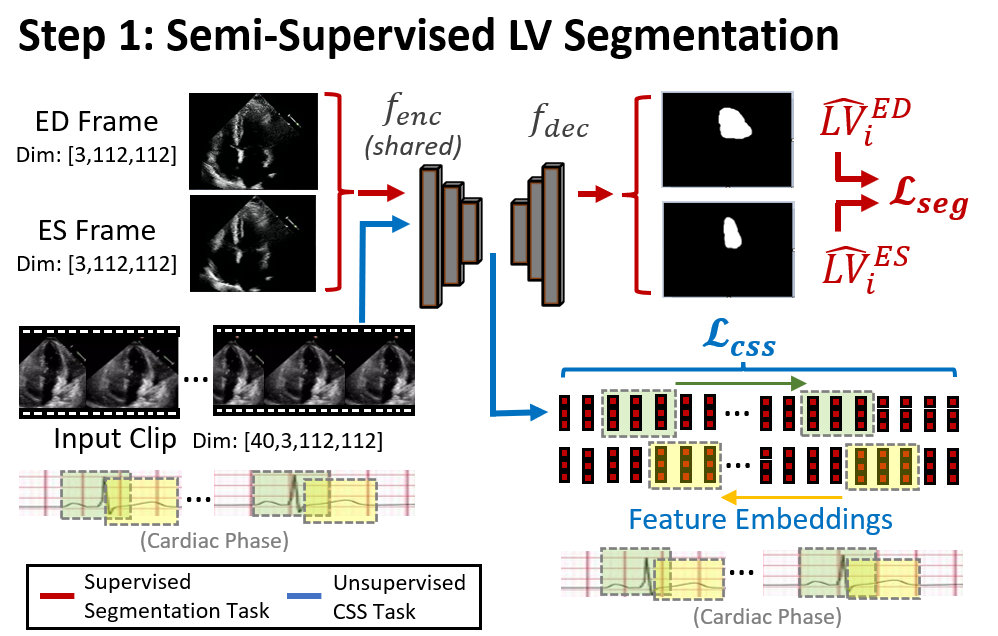
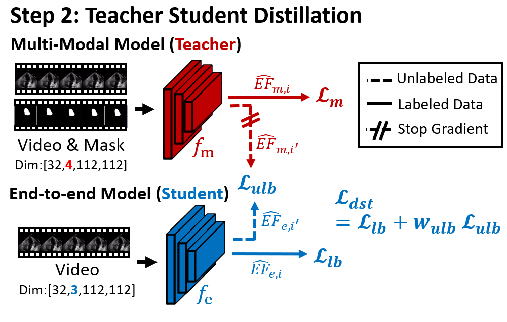

# Cyclical Self-Supervision for Semi-Supervised Ejection Fraction Prediction from Echocardiogram Videos


This is the implementation of CSS for Semi-Supervised Ejection Fraction Prediction for the paper ["Cyclical Self-Supervision for Semi-Supervised Ejection Fraction Prediction from Echocardiogram Videos"]().



<br />
<br />

## Data

Researchers can request the EchoNet-Dynamic dataset at https://echonet.github.io/dynamic/ and set the directory path in the configuration file, `echonet.cfg`.

<br />
<br />

## Environment

It is recommended to use PyTorch `conda` environments for running the program. A requirements file has been included. 

<br />
<br />

## Training and testing

The code must first be installed by running 
    
    pip3 install --user .

under the repository directory `CSS-SemiVideo`. Training consists of three components:

<br />

### 1) To train the CSS semi-supervised segmentation model, run:

```
echonet seg_cycle --batch_size=20 --output=output/css_seg --loss_cyc_w=0.01 --num_epochs=25 --rd_label=920 --rd_unlabel=6440 --run_test --reduced_set 
```

The LV segmentation prediction masks of all frames must be inferred for the second stage. To do so, run:

```
echonet seg_cycle --batch_size=20 --output=output/css_seg --loss_cyc_w=0.01 --num_epochs=25 --rd_label=920 --rd_unlabel=6440 --skip_test --reduced_set --run_inference=train

echonet seg_cycle --batch_size=20 --output=output/css_seg --loss_cyc_w=0.01 --num_epochs=25 --rd_label=920 --rd_unlabel=6440 --skip_test --reduced_set --run_inference=val

echonet seg_cycle --batch_size=20 --output=output/css_seg --loss_cyc_w=0.01 --num_epochs=25 --rd_label=920 --rd_unlabel=6440 --skip_test --reduced_set --run_inference=test
```

The segmentation prediction outputs will be located under the output folder `output/css_seg`. To reduce installation time for EchoNet-Dynamic, these are moved to a separatate directory parallel to `CSS-SemiVideo`, i.e. `CSS-SemiVideo/../infer_buffers/css_seg`. Segmentation masks are also sourced from this location for Step 2 of the framework. 

To do this, run:

```
mkdir ../infer_buffers/css_seg
mv output/css_seg/*_infer_cmpct ../infer_buffers/css_seg/
```
<br />

### 2) To train the multi-modal LVEF prediction model, run:

```
echonet video_segin --frames=32 --model_name=r2plus1d_18 --period=2 --batch_size=20 --output=output/teacher_model --num_epochs=25 --rd_label=920 --rd_unlabel=6440 --run_test --segsource=css_seg
```
<br />

### 3) To train teacher-student distillation, run:

```
echonet vidsegin_teachstd_kd --frames=32 --model_name=r2plus1d_18 --period=2 --batch_size=20 --output=output/end2end_model --num_epochs=25 --rd_label=920 --rd_unlabel=6440 --run_test --reduced_set --max_block=20 --segsource=css_seg --w_unlb=5 --batch_size_unlb=10 --weights_0=output/teacher_model/best.pt 
```


<br />
<br />


## Pretrained models

Trained checkpoints and models can be downloaded from:

1) CSS for semi-supervised segmentation: https://hkustconnect-my.sharepoint.com/:f:/g/personal/wdaiaj_connect_ust_hk/EqiP-N0MDRZGlwqr5PeZUrYBtLki8QWtBlMqRK1FNkjbcw?e=DIpkIm

2) Multi-modal LVEF regression: https://hkustconnect-my.sharepoint.com/:f:/g/personal/wdaiaj_connect_ust_hk/ErxaHepi4ndAnMcvSOwTH5wBDI6rHypqdcBiXF8B0XYvmg?e=Rud7Pf

3) Teacher-student distillation: https://hkustconnect-my.sharepoint.com/:f:/g/personal/wdaiaj_connect_ust_hk/Ev7mQ1ReI05LtiDIqQu1IpYBC6xN4R47PsYnhDUQr4n3fw?e=US4caq


To run with the pretrained model weights, replace the `.pts` files in the target output directory with the downloaded files. 

<br />

|  Experiments         | MAE   | RMSE   | R<sup>2</sup>   |
| ---------- | :-----------:  | :-----------: | :-----------:  |
| Multi-Modal    | 5.13  &plusmn; 0.05  | 6.90  &plusmn; 0.07   | 67.6%	&plusmn;  0.5 |
| Teacher-student Distillation    | 4.90 &plusmn; 0.04  | 6.57  &plusmn; 0.06   | 71.1%	&plusmn;  0.4 |

<br />
<br />

## Notes
* Contact: DAI Weihang (wdai03@gmail.com)
<br />
<br />

## Citation
If this code is useful for your research, please consider citing:

(to be released)
